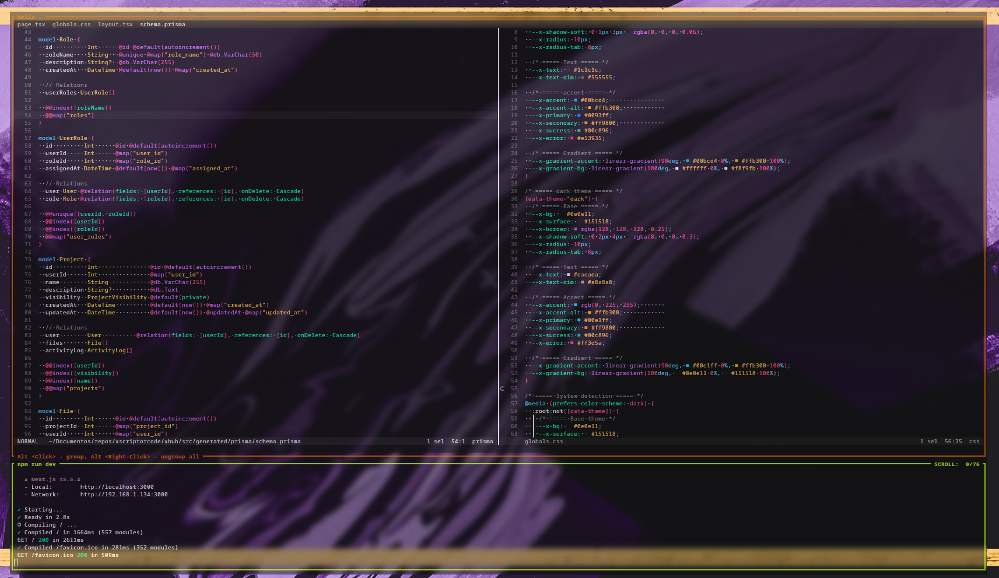

<h1 align="center"> Xscriptor Helix </h1>

---

<p align="center">  </p>

Essential settings to improve accessibility of helix using the Xscriptor themes.





## Installation

Quick remote install using curl or wget:

```bash
# Complete (config + themes) with curl
sh -c "$(curl -fsSL https://raw.githubusercontent.com/xscriptordev/helix/main/install.sh)" -- --complete

# Complete (config + themes) with wget
sh -c "$(wget -qO- https://raw.githubusercontent.com/xscriptordev/helix/main/install.sh)" -- --complete
```

Other modes:

```bash
# Themes only
sh -c "$(curl -fsSL https://raw.githubusercontent.com/xscriptordev/helix/main/install.sh)" -- --themes-only
sh -c "$(wget -qO- https://raw.githubusercontent.com/xscriptordev/helix/main/install.sh)" -- --themes-only

# Minimal config + themes
sh -c "$(curl -fsSL https://raw.githubusercontent.com/xscriptordev/helix/main/install.sh)" -- --minimal
sh -c "$(wget -qO- https://raw.githubusercontent.com/xscriptordev/helix/main/install.sh)" -- --minimal

# Custom branch or repository
sh -c "$(curl -fsSL https://raw.githubusercontent.com/xscriptordev/helix/main/install.sh)" -- --branch main --repo https://github.com/xscriptordev/helix
sh -c "$(wget -qO- https://raw.githubusercontent.com/xscriptordev/helix/main/install.sh)" -- --branch main --repo https://github.com/xscriptordev/helix
```

## Script Options

- --themes-only: install only themes
- --minimal: install minimal config + themes
- --complete: install complete config + themes (default)
- --branch <name>: remote branch to use (default: main)
- --repo <url>: remote repository URL (default: https://github.com/xscriptordev/helix)
- --dry-run: show actions without executing
- --force: overwrite without creating backup
- --no-backup: do not create a backup of existing config
- --help: show help

## What the installer does

- Detects local repository or downloads it remotely:
  - Uses git if available, otherwise downloads a tarball via curl or wget and extracts it with tar.
- Installs themes into ~/.config/helix/themes from the repository [themes](./themes).
- Installs either minimal or complete Helix config into ~/.config/helix/config.toml from:
  - Minimal: [settings/minimal/config.toml](./settings/minimal/config.toml)
  - Complete: [settings/complete/config.toml](./settings/complete/config.toml)
- Creates a timestamped backup of an existing ~/.config/helix/config.toml by default. You can disable it with --no-backup or bypass with --force.
- Default mode is --complete to leave Helix ready with the “x” theme; you can switch later to any theme included.

## Requirements

- Helix installed on your system
- git (optional), curl or wget, and tar (required for non-git download)

## Selecting a theme

- Set a theme in your Helix config:
  ```toml
  theme = "x"
  ```
- Available themes are installed in ~/.config/helix/themes (e.g., "oslo", "tokio", "berlin", etc.). Change the value to any theme filename (without .toml).
